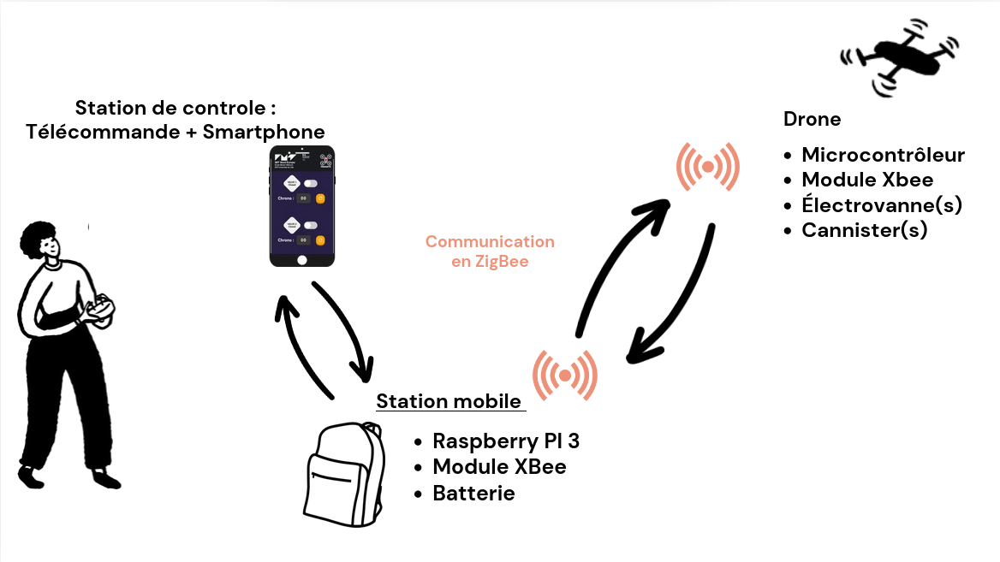

# Drone-Payload
UV projet de P1 en NU / IS, par des FISE 2025 en CI3.

**Membres du groupe** :
- Timothé KOBAK (timothe.kobak@etu.imt-nord-europe.fr)
- Matis SPINELLI (matis.spinelli@etu.imt-nord-europe.fr)
- Arthur MATA (arthur.mata@etu.imt-nord-europe.fr)

**Remarque** : La documentation a été rédigée en partant du principe que toutes les commandes sont effectuées sur un système Ubuntu.

## Tags

Nous avons sauvegardé différentes versions du projet au fil du temps, en fonction des solutions que nous testions.
Il suffit de faire `git checkout <tag>` pour charger le repository d'une ancienne version en local.

- Version **WiFi** (tag: `rpi_wifi`): Serveur utilisant Flask et des fichiers Python et le WiFi pour communiquer avec l'Arduino. C'est une solution simple mais avec une courte portée (moins de 50m a priori).
- Version **PHP** (tag: `php_version`): Page web entièrement en PHP au lieu de Python, fonctionnant avec un serveur *lighttpd*, et communicant en WiFi avec l'Arduino. C'est le prototype le plus ancien du projet. Il est nécessaire de modifier la configuation lighttpd acutelle pour la faire fonctionner.
- Version **1.0** (tag: `parasite_1.0`): Première version fonctionnelle basée sur ZigBee avec une arduino et un module XBee sur le drone et une Raspberry Pi au sol. L'interface web est toujours présente mais tourne en Python via Flask.

## Sommaire de la documentation

Voici une hiérarchie de la documentation présente dans le repository. Les liens sont clicables, et amènent aux fichiers en **markdown** correspondants à la section.

- [Installation PI](./doc/Installation_PI.md) : guide d'installation et de déploiement sur la PI
- [TODO list](./TODO.md) : liste du matériel manquant nécessaire au projet
- [Web](./web/README.md) : code source pour la page web de la PI
- [Scripts](./scripts/README.md) : script bash pour l'automatisation de la tâche déploiement du code sur la PI
- [Design](./Design/README.md) : fichier figma pour le design du logo "PARASITE"
- _Doc générales_
  - [Arduino](./doc/Arduino.md) : installation des fichiers pour Arduino
  - [Payload](./doc/Payload.md) : Carctéristiques du drone et de sa charge utile
  - [SDK](./doc/SDK.md) : Software development kit de DJI pour le drone
    - [MSDK](./doc/SDK/MSDK.md) : Piste du SDK pour mobiles
    - [OSDK](./doc/SDK/OSDK.md) : Piste du SDK embarqué sur le drone

## System Overview

The air sampling system consists of three main components:

1. Drone-mounted payload
2. Ground-level Raspberry Pi
3. User interface device (any web-enabled device)

The **MATRICE 600 PRO** drone serves as the aerial platform for this project.

## Key Features

- **Long-range communication**: Utilizes XBee modules for extended range capabilities
- **High-altitude sampling**: Designed to collect air samples at approximately 120 meters
- **Remote operation**: Controlled via a web-based interface

## Hardware Components

### Payload (Drone-Mounted)

- 1 XBee Module (PRO S2C) with antenna
- 1 Arduino board
- Solenoid valve(s) (1-2 depending on requirements)
- Electrical relay(s) (1-2 matching solenoid valve count)
- Battery pack

### Ground Station

- Raspberry Pi 3(for communication relay)
- XBee Module (PRO S2C) with antenna

### Configuration Setup

- Linux laptop
- Ethernet cable
- Battery Pack

## Communication Architecture

## Advantages

- **Versatility**: Adaptable for various air quality monitoring applications
- **Precision**: Accurate sample collection at specific altitudes
- **Safety**: Enables sampling in hard-to-reach or hazardous areas
- **Real-time control**: Web-based interface allows for immediate adjustments

## Future Enhancements

- Integration of real-time air quality sensors
- Automated flight path programming for systematic sampling

--------------------------------

# Installation 

## 1. Raspberry Pi Setup

To set up the Raspberry Pi, please follow the detailed installation guide in [this file](./doc/Installation_PI.md).

Comme indiqué dans ce fichier, le nombre de vannes utilisé peut être modifié facilement. Il suffit de modifier la valeur `nb_vannes` dans le fichier de configuration [config.json](./web/static/config.json)

## 2. Xbee Configuration 

### Configure XBee Radio:

To properly configure and set up communication between the two XBee modules (one for the Arduino and one for the Raspberry Pi), follow these steps:

1. **Connect the XBee Modules:**
   - Plug both XBee modules into your laptop’s USB ports using XBee USB adapters or a USB-to-serial converter.

2. **Open XCTU Software:**
   - Download and install the [XCTU Software](https://www.digi.com/products/xbee-rf-solutions/xctu-software/xctu) if you haven't already.
   - Open the software and ensure both XBee modules are detected under the "Discover Devices" tab.

3. **Load Configuration Profiles:**
   - You have two configuration profiles provided in the project repository:
     - `profile_arduino.xpro` for the XBee connected to the Arduino.
     - `profile_rpi_coordinator.xpro` for the XBee connected to the Raspberry Pi.
   - To apply these profiles:
     1. Select the XBee module from the device list in XCTU.
     2. Go to the "Profiles" tab and click "Load."
     3. Navigate to the `xbee/arduino` directory, select the appropriate `.xpro` file, and apply the configuration.
     4. Repeat the process for both XBee modules (one for `profile_arduino.xpro` and the other for `profile_rpi_coordinator.xpro`).

4. **Verify XBee Communication:**
   - After applying the configurations, ensure that both XBee modules are set up to communicate with each other. The `profile_rpi_coordinator.xpro` file configures the Raspberry Pi XBee as the communication coordinator, while `profile_arduino.xpro` sets up the Arduino XBee as a remote device.
   - Check the communication settings such as PAN ID, baud rate, and operating channel to ensure they match for both modules.

5. **Connect XBee to Raspberry Pi and Arduino:**
   - **For Arduino:**  
     - Connect the **TX (Transmitter)** pin of the Arduino to the **DIN** pin of the XBee.
     - Connect the **RX (Receiver)** pin of the Arduino to the **DOUT** pin of the XBee.
     - Power the XBee with 3.3V (not 5V) and connect the GND of the Arduino to the GND of the XBee.
   - **For Raspberry Pi:**  
     - Use a USB-to-serial converter to connect the XBee to the Raspberry Pi via USB.
     - Alternatively, connect the **TX/RX** pins of the Raspberry Pi directly to the **DIN/DOUT** pins of the XBee (use a level shifter if required to match voltage levels).

6. **Testing Communication:**
   - After the physical connection and configuration, you can test the communication by sending a basic message from one XBee to the other using XCTU’s console interface. Ensure that the message sent by the Arduino’s XBee is received by the Raspberry Pi’s XBee, confirming successful communication.

## 3. Arduino Setup

To set up the Arduino side of the project, follow these steps:

1. **Install Arduino IDE:**
   - Download and install the [Arduino IDE](https://www.arduino.cc/en/software) if you haven't already.
   
2. **Connect the Arduino:**
   - Connect your Arduino board to your computer via USB.
   
3. **Install Required Libraries:**
   - Open the Arduino IDE and install the necessary libraries for the project:
     - `XBee.h` or any other libraries used in your project.

4. **Upload the Code:**
   - Open the provided Arduino `.ino` file.
   - Select the correct board and port from the "Tools" menu.
   - Upload the sketch to the Arduino.

## 4. Wiring

Here’s how to wire the components together:

### Arduino to XBee:

You can use a diagram like this to visualize the wiring:

### Raspberry Pi to XBee:
- Use a USB-to-serial converter to connect the XBee to the Raspberry Pi via USB.
- Alternatively, connect the **TX/RX** pins of the Raspberry Pi directly to the **DIN/DOUT** pins of the XBee (ensure you use a level shifter to match voltage levels if required).

### Other Connections:
- Add any additional connections (e.g., sensors, LEDs) according to your project needs.

--------------------------------
  
## Anciens repositories :
- https://github.com/ceri-num/alpaga-rambouillet/
- https://github.com/ceri-num/alpaga-ros
