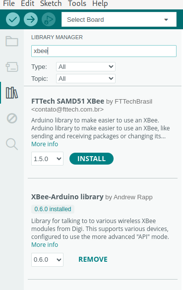

# Programmation de l'Arduino

Le programme de l'Arduino peut être installé via l'IDE Arduino.

[<-- Retour en arrière](./README.md)

Il est également possible de l'installer via l'outil de commande `arduino-cli` si vous disposez de ce dernier.

Sous le dossier `/xbee/arduino/`, on trouve :

- Le programme de l'Arduino, `arduino.ino`.
- Le profil XCTU de la XBee connectée à l'Arduino, `profile_arduino.xpro`.
- (Optionnel) `sketch.yaml`, un fichier de description pour l'outil de commande `arduino-cli`.

## Librairies nécessaires :

- **SoftwareSerial** : Devrait déjà être installé de base avec l'IDE Arduino.
- **XBee-Arduino** : Doit être installé en plus de l'IDE (voir partie suivante).

## Installation avec l'IDE Arduino

- Ouvrer le programme `arduino.ino` situé sous `/xbee/arduino/`.
- Installer la librairie **XBee-Arduino** (seconde entrée de la liste) :

- Sélectionner le port sur lequel la carte est connecté dans l'onglet **Tools**.
- Appuyer sur le bouton **Upload** (flèche en haut à gauche).
