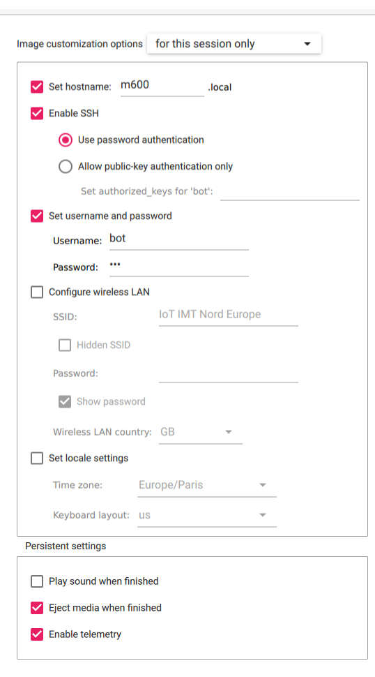

# Installation de l'environnement complet sur la PI

Doc encore à l'état de brouillon.

## Installation de l'OS sur la Raspberry Pi

```
sudo apt update
sudo apt install rpi-imager
```
Lancer Imager.

Raspberry Pi OS Lite (64 bits) in "Other" :


Et choisir la carte SD formatée au préalable dans "Storage".
Dans la options, configurer comme ci-dessous :


Se connecter en ssh : `ssh bot@10.89.2.1` en étant connecté à IOT IMT NORD EUROPE. Il faut donc connecter la PI en Ethernet au réseau.
Le mot de passe est celui mis dans les paramètres de Raspberry Imager.

### RaspAP

Les commandes suivantes sont à effectuer en ssh sur la pi

Source d'infos : https://raspap.com/#quick

```
sudo apt update
sudo apt full-upgrade
sudo reboot
```

```
sudo raspi-config
```

Dans le menu qui apparaît :
- Dans `Localisation Options` > `Locale` : sélectonner `fr_FR.UTF-8 UTF-8` puis `en_GB.UTF-8`.
- Dans `Localisation options` > `Timezone` : sélectionner `Europe` puis `Paris`.
- Dans `Localisation Options` > `WLAN Country` : sélectionner `FR France`.

```
curl -sL https://install.raspap.com | bash
```

Dans les questions qui suivent :
- Laisser le chemin `/var/www/html` par défaut.
- Accepter `Complete installation with these values?`.
- Dire non à toutes les questions suivantes.
- Accepter de faire un reboot.

Vous pouvez vous rendre sur la page de RaspAP en tapant l'adresse IP de la PI sur le réseau IOT IMT NORD EUROPE en tant qu'url :
- **username** : `admin`
- **password** : `secret`

Sur cette page, rendez-vous dans le menu **Hotspot**, et remplissez les champs comme les mages ci-dessous :


Appuyer sur `Save settings` puis `Restart Hotspot`.

Le réseau **M600_RPI** devrait apparaître quelques secondes plus tard. Le mot de passe est celui configuré dans les *security settings*, dans le champ **PSK**.

```
sudo nano /etc/lighttpd/lighttpd.conf
```
Puis changer le port `80` en port `8080`, et restart le service `sudo systemctl restart lighttpd.service`

Dorénavant, l'url pour se rendre sur la page de raspap est : `http://<adresseIP>:8080`.

## Installation de l'environnement de production

Créer le dossier qui contiendra les fichiers de l'appli web :
`mkdir /home/bot/flask_app`

## Serveur en production

Vous pouvez vérifier les commandes suivantes dans ce tuto si vous le désirez : https://sysadmin.cyklodev.com/deployer-une-application-flask/.

### Config du service :

Installation d'une dépendance pour faire tourner le serveur :
```
sudo apt install gunicorn
```

Mise en place du service dans *systemd* :
```
sudo nano /etc/systemd/system/parasiteApp.service
```

Coller le contenu suivant dans ce fichier :
```
[Unit]
Description=Gunicorn Flask Parasite App 
After=network.target

[Service]
User=bot
Group=bot
WorkingDirectory=/home/bot/flask_app
ExecStart=sudo gunicorn --chdir /home/bot/flask_app --workers 1 --bind 0.0.0.0:80 wsgi:app

[Install]
WantedBy=multi-user.target
```
Save the file and close it.

Installation de flask :
```
sudo apt install python3-flask
```

Lancer le service gunicorn :
```
sudo systemctl enable parasiteApp.service
sudo systemctl start parasiteApp.service
```

Et en notant les adresses IP, bien veiller à ce que l'url soit en "http" et non en "https".

## Dépendances côté développeur :

**Attention**, les commandes suivantes sont à effectuer son le pc du développeur en local :

Après avoir fait un git clone du repository à l'endroit de votre choix sur votre pc :

```
cd drone-payload
sudo chmod +x -R ./scripts
```

Installation de sshpass pour l'exécution des scripts :
```
sudo apt install sshpass
```

