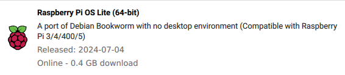
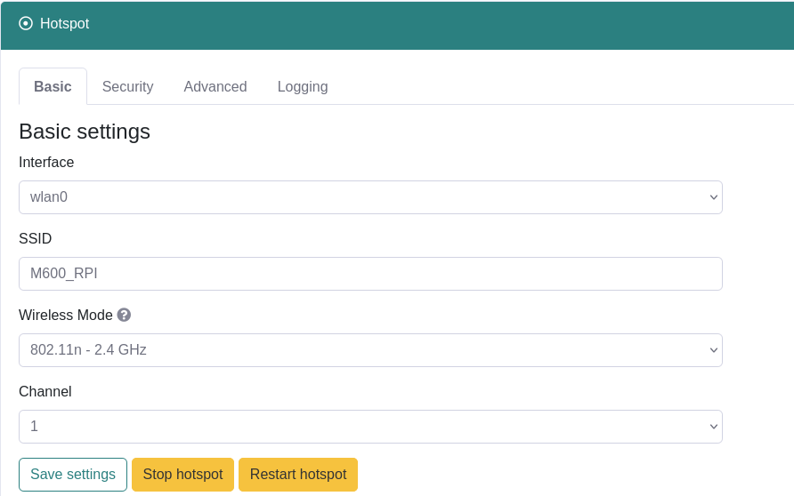
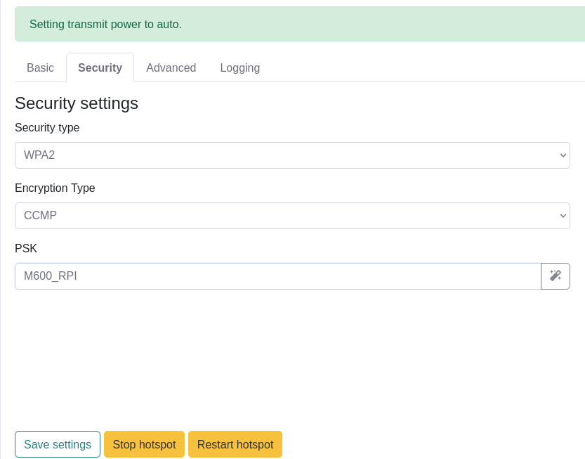

# Installation de l'environnement complet sur la PI

[<-- Retour en arrière](../README.md)

## Installation de l'OS sur la Raspberry Pi

```
sudo apt update
sudo apt install rpi-imager
```
Lancer Imager.

Raspberry Pi OS Lite (64 bits) in "Other" :



Et choisir la carte SD formatée au préalable dans "Storage".
Dans la options, configurer comme ci-dessous :


Se connecter en ssh : `ssh bot@10.89.2.1` ou `ssh bot@10.89.2.55` en étant connecté à IOT IMT NORD EUROPE. Il faut donc connecter la PI en Ethernet au réseau.
Le mot de passe est celui mis dans les paramètres de Raspberry Imager.

> **Note :**
> Pour se connecter à la Raspberry Pi sur un réseau différent, ou si son adresse IP a changé, vous pouvez utiliser `arp-scan -lg` pour essayer de la trouver.  

### RaspAP

Les commandes suivantes sont à effectuer en ssh sur la pi

Source d'infos : https://raspap.com/#quick

```
sudo apt update
sudo apt full-upgrade
sudo reboot
```

```
sudo raspi-config
```

Dans le menu qui apparaît :
- Dans `Localisation Options` > `Locale` : sélectonner `fr_FR.UTF-8 UTF-8` puis `en_GB.UTF-8`.
- Dans `Localisation options` > `Timezone` : sélectionner `Europe` puis `Paris`.
- Dans `Localisation Options` > `WLAN Country` : sélectionner `FR France`.

```
curl -sL https://install.raspap.com | bash
```

Dans les questions qui suivent :
- Laisser le chemin `/var/www/html` par défaut.
- Accepter `Complete installation with these values?`.
- Dire non à toutes les questions suivantes.
- Accepter de faire un reboot.

(Sur la Raspberry Pi) Éditer le fichier `/lib/systemd/system/hostapd.service` :

```
[Unit]
Description=Access point and authentication server for Wi-Fi and Ethernet
Documentation=man:hostapd(8)
After=network.target
ConditionFileNotEmpty=/etc/hostapd/hostapd.conf

[Service]
Type=forking
PIDFile=/run/hostapd.pid
Restart=on-failure
RestartSec=2
Environment=DAEMON_CONF=/etc/hostapd/hostapd.conf
EnvironmentFile=-/etc/default/hostapd
ExecStart=/usr/sbin/hostapd -B -P /run/hostapd.pid $DAEMON_OPTS ${DAEMON_CONF}
ExecStartPre=/bin/sleep 1                                                        # Ajouter cette ligne 

[Install]
WantedBy=multi-user.target
```

Puis redémarrer la Pi.

Vous pouvez vous rendre sur la page de RaspAP en tapant l'adresse IP de la PI sur le réseau IOT IMT NORD EUROPE en tant qu'url :
- **username** : `admin`
- **password** : `secret`

Sur cette page, rendez-vous dans le menu **Hotspot**, et remplissez les champs comme les mages ci-dessous :



Appuyer sur `Save settings` puis `Restart Hotspot`.

Le réseau **M600_RPI** devrait apparaître quelques secondes plus tard. Le mot de passe est celui configuré dans les *security settings*, dans le champ **PSK**.

```
sudo nano /etc/lighttpd/lighttpd.conf
```
Puis changer le port `80` en port `8080`, et restart le service `sudo systemctl restart lighttpd.service`

Dorénavant, l'url pour se rendre sur la page de raspap est : `http://<adresseIP>:8080`.

## Installation de l'environnement de production

Créer le dossier qui contiendra les fichiers de l'appli web :
`mkdir /home/bot/flask_app`

## Serveur en production

Vous pouvez vérifier les commandes suivantes dans ce tuto si vous le désirez : https://sysadmin.cyklodev.com/deployer-une-application-flask/.

### Config du service :

Installation d'une dépendance pour faire tourner le serveur :
```
sudo apt install gunicorn
```

Mise en place du service dans *systemd* :
```
sudo nano /etc/systemd/system/parasiteApp.service
```

Coller le contenu suivant dans ce fichier :
```
[Unit]
Description=Gunicorn Flask Parasite App 
After=network.target

[Service]
User=bot
Group=bot
WorkingDirectory=/home/bot/flask_app
ExecStart=sudo gunicorn --chdir /home/bot/flask_app --workers 1 --bind 0.0.0.0:80 wsgi:app

[Install]
WantedBy=multi-user.target
```

### Config du DNS

Éditer le fichier `/etc/dnsmask.d/090_raspap.conf` et ajouter les lignes suivantes à la fin du fichier :

```
port=53
listen-address=127.0.0.1,10.3.141.1
interface=wlan0

domain=station.local
address=/station.local/10.3.141.1
```

### Config du serveur

Installation de flask :
```
sudo apt install python3-flask
```

Installation de pip :
```
sudo apt install python3-pip
```

Installation de digi-xbee :
```
sudo apt install python3-serial && \
    pip download digi-xbee && \
    unzip digi_xbee-1.5.0-py3-none-any.whl && \
    sudo mv digi /usr/local/lib/python3.11/dist-packages/
```

Lancer le service gunicorn :
```
sudo systemctl enable parasiteApp.service
sudo systemctl start parasiteApp.service
```

Et en notant les adresses IP, bien veiller à ce que l'url soit en "http" et non en "https".

## Dépendances côté développeur :

**Attention**, les commandes suivantes sont à effectuer son le pc du développeur en local :

Faites un git clone du repository à l'endroit de votre choix sur votre pc.

### Configuration des scripts

Dans le fichier de configuration [config.json](../web/static/config.json), préciser le nombre de vannes utilisées (par défaut sur 2).

Si vous modifiez cette valeur du fichier de configuration, il faut mettre à jour le code sur la PI et redémarrer le service (voir la section suivante).

Puis, trouver l'adresse MAC de la PI grâce à `arp-scan` :
```
sudo apt install arp-scan
```

En étant connecté à IoT IMT Nord Europe, tapez :
```
sudo arp-scan -lg
```

L'adresse MAC de la PI se trouve très probablement à la ligne comportant le nom `Raspberry Pi Trading Ltd`.
Écrivez cette adresse dans la variable `IP_IOT=` en haut du fichier [find_pi.sh](../scripts/update_web.sh).
Puis faites de même en étant connecté au réseau de la PI, dans la variable `IP_RPI=`.

Puis uploader le code source sur la PI en exécutant le script correspondant dans votre repository :
```
cd drone-payload
sudo chmod +x -R ./scripts
```

Installation de sshpass pour l'exécution des scripts :
```
sudo apt install sshpass
```

Enfin, en étant connecté à IoT IMT Nord Europe, lancer le script :
```
./scripts/update_web.sh
```
Si vous êtes connecté à un autre réseau, ou que vous voulez préciser l'adresse manuellement, veuillez consulter l'aide [ici](../scripts/README.md) ou faire `./scripts/update_web.sh -h`.
