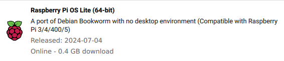
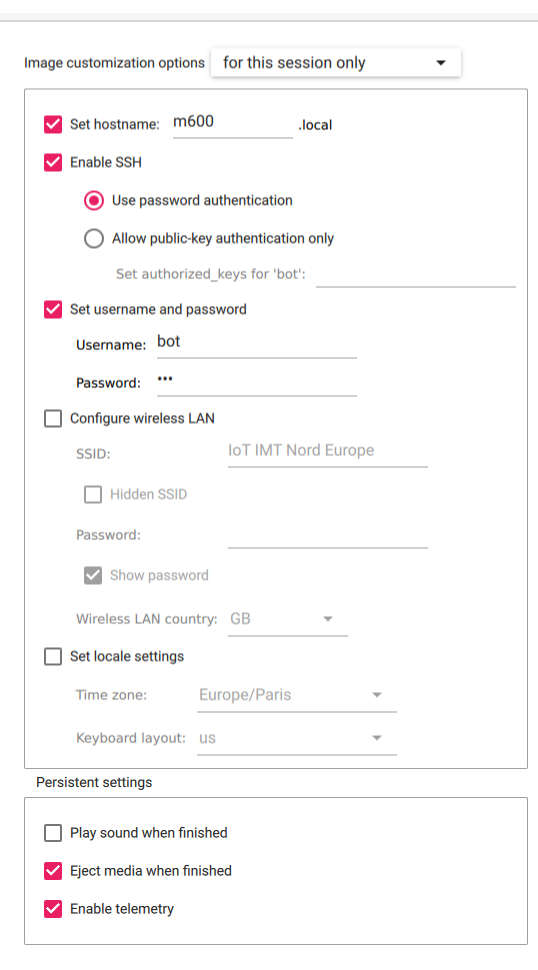

# Installation de l'environnement complet sur la PI

Doc encore à l'état de brouillon.

## Installation de l'OS sur la Raspberry Pi

```
sudo apt update
sudo apt install rpi-imager
```
Lancer Imager via les applis.

Raspberry Pi OS Lite (64 bits) in "Other" :

Et choisir la carte SD formatée au préalable dans "Storage".
Dans la options, configurer comme ci-dessous :


Se connecter en ssh : `ssh bot@10.89.2.1` en étant connecté à IOT IMT NORD EUROPE.
Le mot de passe est celui mis dans les paramètres de Raspberry Imager.

### RaspAP

Source d'infos : https://raspap.com/#quick

```
sudo apt update
sudo apt full-upgrade
sudo reboot
```


## Serveur en production

Lien du tuto avec tout dedans : https://sysadmin.cyklodev.com/deployer-une-application-flask/

### Config du service :

Sans reverse proxy :
```
[Unit]
Description=Gunicorn Flask Parasite App 
After=network.target

[Service]
User=bot
Group=bot
WorkingDirectory=/home/bot/flask_app
ExecStart=gunicorn --chdir /home/bot/flask_app --workers 3 --bind 0.0.0.0:5000 wsgi:app

[Install]
WantedBy=multi-user.target
```

`sudo systemctl enable parasiteApp.service`
`sudo systemctl start parasiteApp.service`